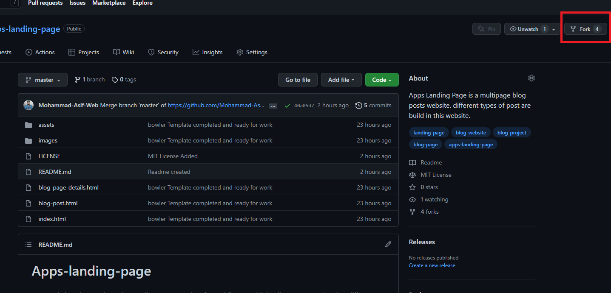
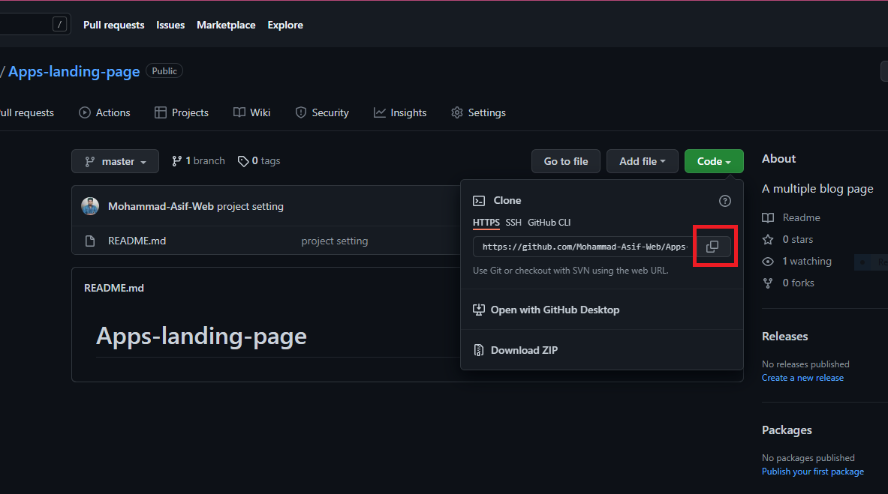
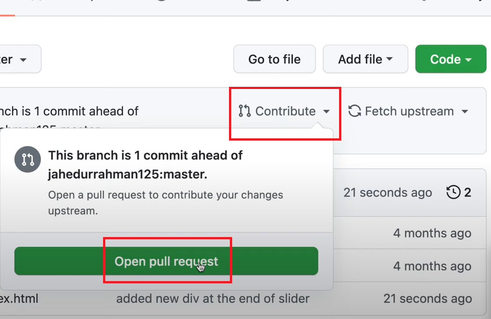
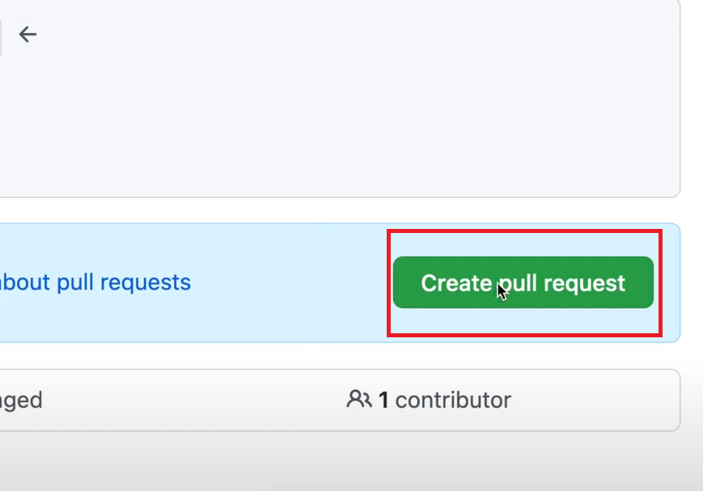
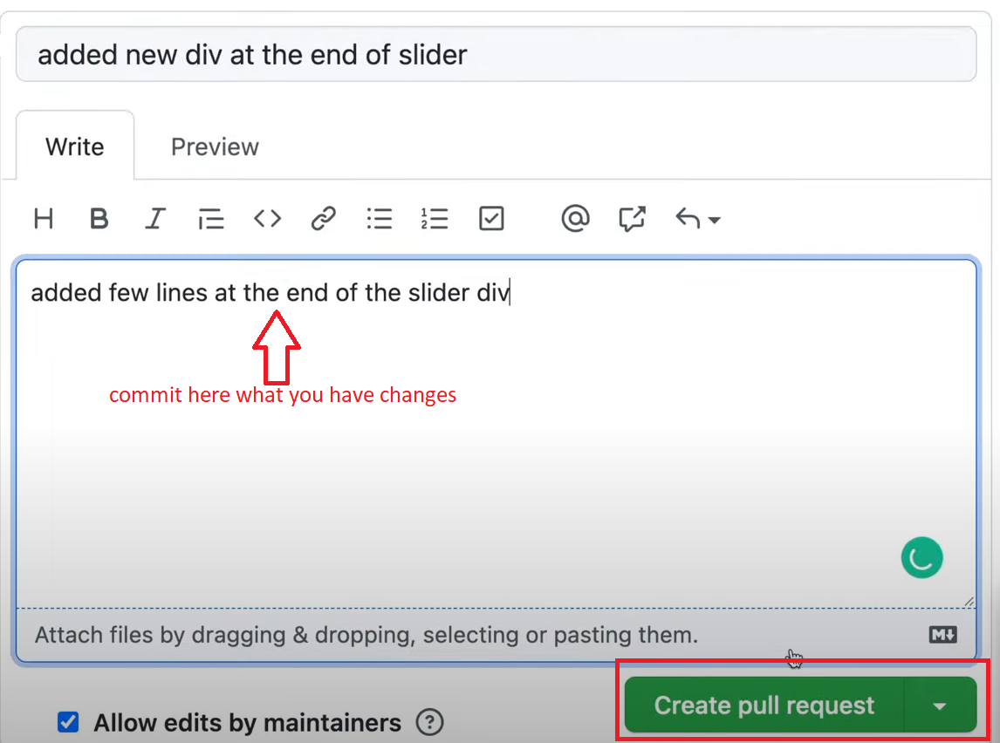

# Apps-landing-page

AppSperia is a clean and creative Landing Page Template for Mobile App. This landing page template has different variations. Well organized and very easy to customize, AppSperia is better way to present and promote your startup mobile app website.

## Features
- Responsive Design
- Unique User Experience
- 4 Color Schemes
- Clean Design
- Smooth Scrolling
- Contact Form
- Multiple Icons
- Pricing Tables
- New Iphone 6, Iphone 7 and Android mockups

## [See on Live Server](https://mohammad-asif-web.github.io/Apps-landing-page/index.html)


## About us
We are the students of  PHP with Laravel Batch-2 group from the BASIS SEIP PROJECT.

This is a specification for recognizing contributors to our group presentation projects in a way that rewards each and every contribution, not just code.so we believe everyone should be praised for their contributions (code or not).

## Contributors
- [Muhammad Asif](https://github.com/Mohammad-Asif-Web)
- [Ahsan Arafat](https://github.com/oytizo)
- [Zubair Ahmed](https://github.com/zubair-uap)
- [Md Sanowar]()
- [Omar Faruk]()
- [Sadia Haque](https://github.com/SadiaHaque207)
- [Md Lutfur Rahman Jelany](https://github.com/mdlutfurrahmanjelany)


# How to contribute
## 1. Fork the repository
<br>


<!--  -->


## 2. Clone your repository

````
$ git clone https://github.com/Mohammad-Asif-Web/Apps-landing-page.git

````

<p align="center">

</p>
<!--    -->


### When you are done with your work, now its time to add the changes to the branch

````
git add .
````

### Now commit those changes

````
git commit -m "write your changes message here"
````

### Push your changes to Github
````
git push origin master
````

### If before someone have added his changes to the branch, git will show you error message and suggest you to do pull first. so you have to write this command
````
git pull origin master
````

### Then again push changes to Github
````
git push origin master
````

## 3. Its time for pull request.
### Now you have to go your repository on GitHub, reload the browser and you'll see a Compare & pull request button. Click on that button.

<br>
<p align="center">


<p>

## Now submit the pull request

<br>
<p align="center">

<p>

### Soon I'll be merging all your changes into the master branch of this project. You will get a notification email once the changes have been merged.


## License

The Apps Landing Page Blog Website is an open-sourced software licensed under the  [MIT License](https://github.com/Mohammad-Asif-Web/Apps-landing-page/blob/master/LICENSE)
